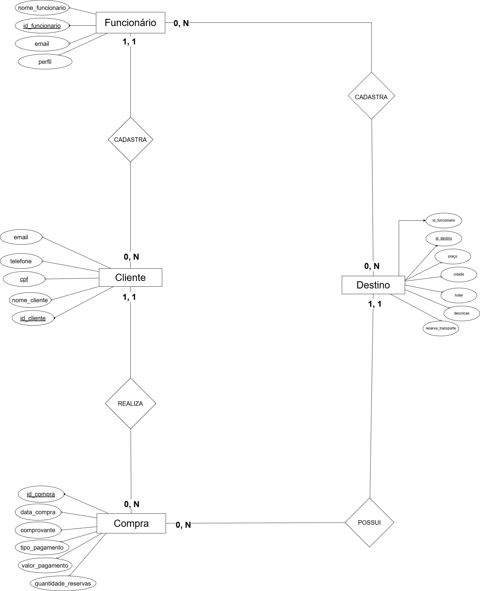
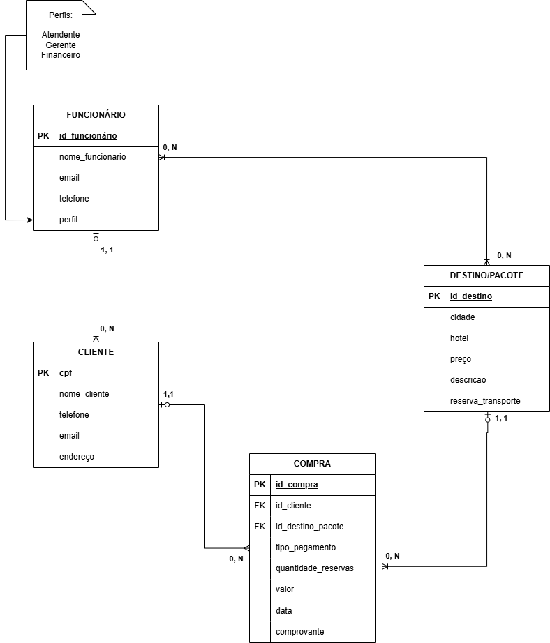

# Artefatos relativos à modelagem de dados do projeto

Este diretório mantém os artefatos relacionados à modelagem de dados do projeto. 

Os principais documentosproduzidos são:

* `diagrama entidade-relacionamento (DER)`
	

* `modelo relacional`
	

